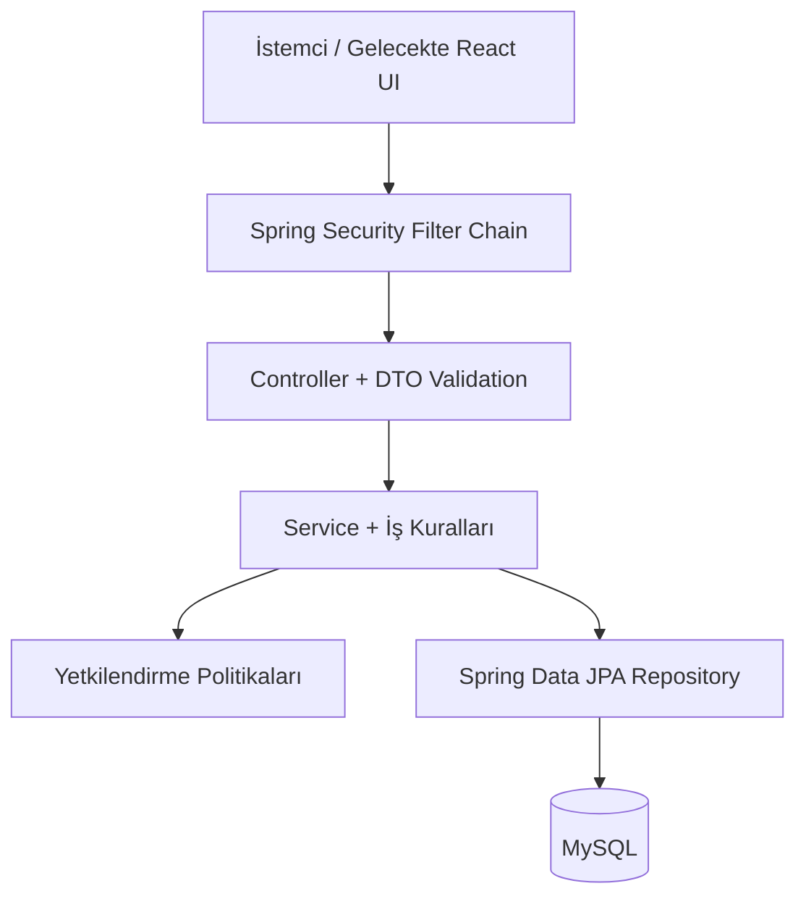
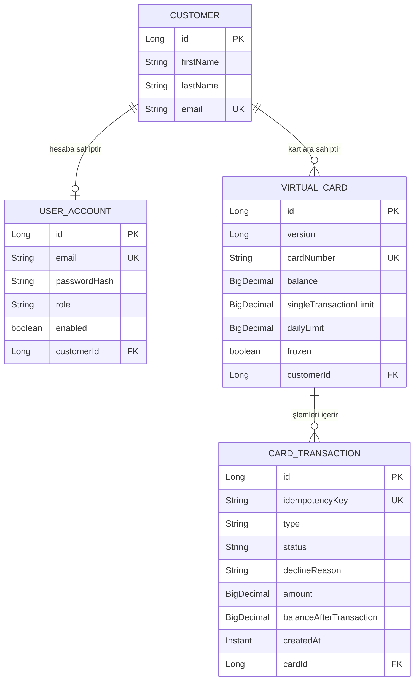
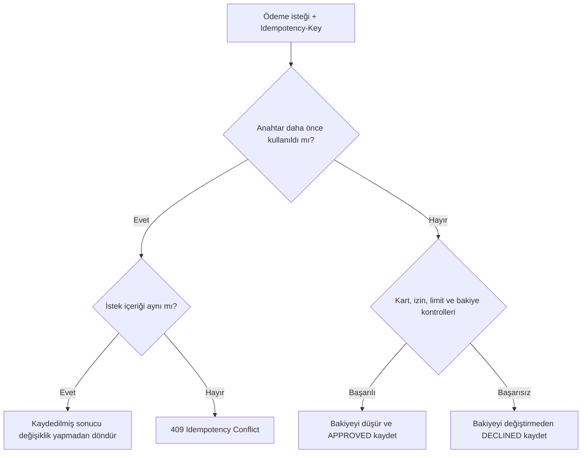
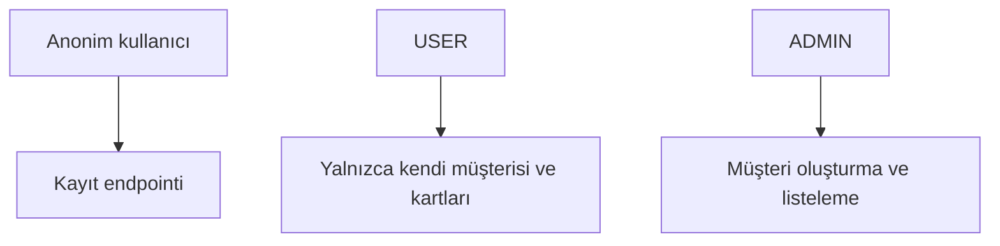
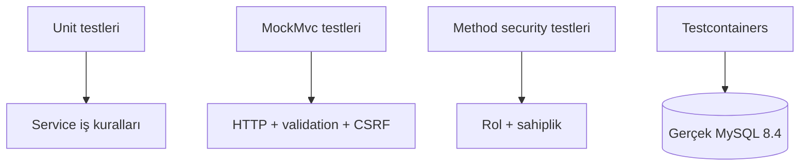

# PayGuard

> Güvenli sanal kart yönetimi ve ödeme yetkilendirme akışlarını modelleyen Spring Boot REST API.

[](https://openjdk.org/projects/jdk/21/)
[](https://spring.io/projects/spring-boot)
[](https://www.mysql.com/)
[](#test-stratejisi)
[](https://maven.apache.org/)

PayGuard; müşteri hesaplarını, sanal kartları ve kart işlemlerini yöneten; ödeme taleplerini kart durumu, bakiye ve kullanım limitlerine göre değerlendiren bir backend projesidir.

Projenin odağı yalnızca CRUD endpointleri oluşturmak değildir. Aynı ödeme isteğinin iki kez işlenmemesi, eş zamanlı bakiye güncellemelerinde veri kaybının engellenmesi, kullanıcının yalnızca kendi verisine erişebilmesi ve kritik iş kurallarının otomatik testlerle doğrulanması hedeflenmiştir.

## İçindekiler

- [Öne çıkan özellikler](#öne-çıkan-özellikler)
- [Mimari](#mimari)
- [Veri modeli](#veri-modeli)
- [Ödeme yetkilendirme akışı](#ödeme-yetkilendirme-akışı)
- [Güvenlik modeli](#güvenlik-modeli)
- [API endpointleri](#api-endpointleri)
- [Teknoloji yığını](#teknoloji-yığını)
- [Projeyi çalıştırma](#projeyi-çalıştırma)
- [Test stratejisi](#test-stratejisi)
- [Proje yapısı](#proje-yapısı)
- [Tasarım kararları](#tasarım-kararları)
- [Yol haritası](#yol-haritası)

## Öne çıkan özellikler

### Kullanıcı ve müşteri yönetimi

- Kullanıcı kaydı ve e-posta normalizasyonu
- BCrypt ile güvenli şifre hashleme
- Benzersiz e-posta kontrolü
- Müşteri bilgilerini görüntüleme, güncelleme ve silme
- Müşteri silindiğinde bağlı kullanıcı hesabını ve oturumu güvenli biçimde sonlandırma
- Eş zamanlı kayıt denemelerinde veritabanı kısıtını anlamlı API hatasına dönüştürme

### Sanal kart yönetimi

- Müşteriye bağlı sanal kart oluşturma
- Kartları listeleme ve kart numarasını özet yanıtlarda maskeleme
- Bakiye yükleme
- Kartı dondurma ve yeniden kullanıma açma
- Tek işlem ve günlük harcama limitlerini güncelleme
- İnternet ve yurt dışı ödeme izinlerini yönetme
- Sayfalama destekli işlem geçmişi

### Ödeme güvenliği

- Kartın dondurulma ve son kullanma tarihi kontrolü
- Yetersiz bakiye kontrolü
- Tek işlem ve günlük limit kontrolü
- İnternet ve yurt dışı işlem izinleri
- Onaylanan ve reddedilen işlemleri nedenleriyle kaydetme
- `Idempotency-Key` ile güvenli tekrar denemeleri
- İşlem anındaki kalan bakiyeyi saklayarak tekrar isteğinde aynı cevabı üretme
- JPA `@Version` optimistic locking ile eş zamanlı bakiye güncellemelerini koruma

## Mimari

PayGuard, sorumlulukları birbirinden ayıran katmanlı bir mimari kullanır.



| Katman | Sorumluluk |
|---|---|
| Controller | HTTP isteğini alır, doğrulanmış DTO'yu servise iletir ve HTTP cevabını üretir. |
| DTO | API'ye giren ve API'den çıkan verinin sözleşmesini tanımlar. |
| Service | Ödeme, limit, sahiplik ve hesap yaşam döngüsü gibi iş kurallarını uygular. |
| Security | Kimlik doğrulama, rol ve kaynak sahipliği kontrollerini gerçekleştirir. |
| Repository | Entity'lerin MySQL üzerinde kalıcı hâle getirilmesini sağlar. |
| Exception Handler | İş ve doğrulama hatalarını anlamlı HTTP cevaplarına dönüştürür. |

## Veri modeli



## Ödeme yetkilendirme akışı



Bir ödeme aşağıdaki nedenlerle reddedilebilir:

- `CARD_FROZEN`
- `CARD_EXPIRED`
- `INSUFFICIENT_BALANCE`
- `SINGLE_TRANSACTION_LIMIT_EXCEEDED`
- `DAILY_LIMIT_EXCEEDED`
- `ONLINE_TRANSACTIONS_DISABLED`
- `INTERNATIONAL_TRANSACTIONS_DISABLED`

## Güvenlik modeli

PayGuard, Spring Security üzerinde session tabanlı kimlik doğrulama kullanır. Geliştirme aşamasında form login ve HTTP Basic desteği aktiftir.



| İşlem | Anonim | USER | ADMIN |
|---|:---:|:---:|:---:|
| Kullanıcı kaydı | ✅ | ✅ | ✅ |
| Kendi müşteri profilini görüntüleme | ❌ | ✅ | Sahiplik kuralına bağlı |
| Kendi profilini güncelleme veya silme | ❌ | ✅ | Sahiplik kuralına bağlı |
| Kendi sanal kartlarını yönetme | ❌ | ✅ | Sahiplik kuralına bağlı |
| Müşteri oluşturma ve tüm müşterileri listeleme | ❌ | ❌ | ✅ |

Uygulanan güvenlik önlemleri:

- Şifreler açık metin olarak değil, BCrypt hash olarak saklanır.
- Kullanıcı kayıt sırasında rol seçemez; yeni hesap her zaman `USER` olur.
- `@EnableMethodSecurity` ve `@PreAuthorize` ile servis katmanı korunur.
- `CustomerAccessPolicy`, giriş yapan kullanıcının hedef müşteri kaydının sahibi olduğunu doğrular.
- CSRF koruması açık bırakılmıştır.
- Durum değiştiren browser isteklerinin geçerli CSRF token taşıması gerekir.
- Başarılı hesap silme işleminden sonra session ve SecurityContext sonlandırılır.

> `permitAll`, CSRF kontrolünü kapatmaz. Bu nedenle kayıt endpointi herkese açık olsa da browser üzerinden yapılan `POST`, `PUT`, `PATCH` ve `DELETE` isteklerinde CSRF token gereklidir.

## API endpointleri

### Kimlik doğrulama

| Metot | Endpoint | Açıklama | Yetki |
|---|---|---|---|
| `POST` | `/api/auth/register` | Müşteri profili ve kullanıcı hesabı oluşturur. | Herkese açık |
| `POST` | `/login` | Spring Security form login işlemini gerçekleştirir. | Herkese açık |
| `POST` | `/logout` | Oturumu ve güvenlik bağlamını sonlandırır. | Giriş yapmış kullanıcı |

### Müşteriler

| Metot | Endpoint | Açıklama | Yetki |
|---|---|---|---|
| `POST` | `/api/customers` | Müşteri oluşturur. | `ADMIN` |
| `GET` | `/api/customers` | Tüm müşterileri listeler. | `ADMIN` |
| `GET` | `/api/customers/{id}` | Müşteri profilini getirir. | Kayıt sahibi |
| `PUT` | `/api/customers/{id}` | Ad ve soyadı günceller. | Kayıt sahibi |
| `DELETE` | `/api/customers/{id}` | Uygun müşteri ve bağlı hesabı siler, oturumu kapatır. | Kayıt sahibi |

### Sanal kartlar ve ödemeler

| Metot | Endpoint | Açıklama |
|---|---|---|
| `POST` | `/api/customers/{customerId}/cards` | Sanal kart oluşturur. |
| `GET` | `/api/customers/{customerId}/cards` | Müşterinin kartlarını listeler. |
| `GET` | `/api/customers/{customerId}/cards/{cardId}` | Kart detayını getirir. |
| `POST` | `/api/customers/{customerId}/cards/{cardId}/balance` | Karta bakiye yükler. |
| `PATCH` | `/api/customers/{customerId}/cards/{cardId}/freeze` | Kartı dondurur. |
| `PATCH` | `/api/customers/{customerId}/cards/{cardId}/unfreeze` | Kartı yeniden kullanıma açar. |
| `PATCH` | `/api/customers/{customerId}/cards/{cardId}/limits` | Kart limitlerini günceller. |
| `PATCH` | `/api/customers/{customerId}/cards/{cardId}/payment-settings` | İnternet ve yurt dışı ödeme izinlerini günceller. |
| `POST` | `/api/customers/{customerId}/cards/{cardId}/payments` | Ödeme isteğini yetkilendirir. |
| `GET` | `/api/customers/{customerId}/cards/{cardId}/transactions?page=0&size=10` | İşlem geçmişini sayfalı getirir. |

Bu bölümdeki bütün kart endpointleri giriş yapan kullanıcının yalnızca kendi `customerId` değeri için çalışır.

### Örnek ödeme isteği

Ödeme endpointi zorunlu bir `Idempotency-Key` header'ı bekler:

```http
POST /api/customers/7/cards/12/payments HTTP/1.1
Idempotency-Key: payment-2026-0001
Content-Type: application/json
```

```json
{
  "amount": 249.90,
  "merchantName": "Example Store",
  "onlineTransaction": true,
  "internationalTransaction": false
}
```

## Teknoloji yığını

| Alan | Teknoloji |
|---|---|
| Dil | Java 21 |
| Framework | Spring Boot 4.1.1 |
| Web | Spring Web MVC |
| Güvenlik | Spring Security, session authentication, BCrypt, CSRF |
| Persistence | Spring Data JPA, Hibernate |
| Veritabanı | MySQL |
| Doğrulama | Jakarta Validation |
| Test | JUnit 5, Mockito, MockMvc, Spring Security Test |
| Entegrasyon testi | Testcontainers + MySQL 8.4 |
| Build | Maven Wrapper |

## Projeyi çalıştırma

### Gereksinimler

- Java 21
- Git
- MySQL 8+
- Testcontainers testleri için çalışan Docker Desktop

Kurulumları doğrulayın:

```powershell
java -version
docker --version
docker info
.\mvnw.cmd -version
```

Maven çıktısındaki Java sürümü de `21` olmalıdır.

### 1. Repoyu klonlayın

```bash
git clone https://github.com/onurerkoc-dev/payguard.git
cd payguard
```

### 2. MySQL veritabanını hazırlayın

```sql
CREATE DATABASE payguard
    CHARACTER SET utf8mb4
    COLLATE utf8mb4_unicode_ci;

CREATE USER 'payguard_user'@'localhost'
    IDENTIFIED BY 'guvenli-bir-sifre';

GRANT ALL PRIVILEGES ON payguard.*
    TO 'payguard_user'@'localhost';

FLUSH PRIVILEGES;
```

### 3. Veritabanı şifresini ortam değişkeni olarak tanımlayın

Geçerli PowerShell oturumu için:

```powershell
$env:PAYGUARD_DB_PASSWORD="guvenli-bir-sifre"
```

Şifreyi `application.properties` veya Git geçmişine eklemeyin.

### 4. Uygulamayı başlatın

Windows:

```powershell
.\mvnw.cmd spring-boot:run
```

macOS/Linux:

```bash
./mvnw spring-boot:run
```

Uygulama varsayılan olarak `http://localhost:8080` adresinde çalışır.

## Test stratejisi

PayGuard'ın güncel test tabanı **144 başarılı testten** oluşur.



| Test türü | Doğruladığı alan |
|---|---|
| Unit test | Servis kuralları, ödeme kararları, idempotency ve hata senaryoları |
| Controller testi | Endpoint, durum kodu, JSON cevabı, validation ve CSRF davranışı |
| Security testi | Login, yanlış şifre, logout, session, rol ve kaynak sahipliği |
| Repository entegrasyon testi | Gerçek MySQL üzerindeki unique constraint ve kalıcılık davranışı |
| Optimistic locking testi | Aynı kartı eş zamanlı güncelleyen işlemlerde kayıp güncellemenin engellenmesi |
| Yaşam döngüsü testi | Müşteri silinirken bağlı kullanıcı hesabının tutarlı biçimde kaldırılması |

Tüm testleri çalıştırmak için:

```powershell
.\mvnw.cmd clean test
```

macOS/Linux:

```bash
./mvnw clean test
```

Testcontainers, entegrasyon testleri sırasında geçici bir `mysql:8.4` container'ı başlatır ve test sonunda yönetir. Image daha önce indirildiyse Docker tekrar indirme yapmayabilir; testin kısa sürmesi normaldir.

Beklenen güncel sonuç:

```text
Tests run: 144, Failures: 0, Errors: 0, Skipped: 0
BUILD SUCCESS
```

## Proje yapısı

```text
src
├── main
│   ├── java/dev/onurerkoc/payguard
│   │   ├── config       # Spring Security yapılandırması
│   │   ├── controller   # REST endpointleri
│   │   ├── dto          # Request ve response sözleşmeleri
│   │   ├── entity       # JPA domain modelleri
│   │   ├── exception    # Domain hataları ve global hata yönetimi
│   │   ├── repository   # Spring Data JPA repositoryleri
│   │   ├── security     # UserDetails ve sahiplik politikası
│   │   └── service      # İş kuralları ve transaction sınırları
│   └── resources
│       └── application.properties
└── test
    └── java/dev/onurerkoc/payguard
        ├── config       # Testcontainers yapılandırması
        ├── controller   # MockMvc testleri
        ├── entity       # Entity davranış testleri
        ├── repository   # Gerçek MySQL entegrasyon testleri
        ├── security     # Authentication ve authorization testleri
        └── service      # Unit testler
```

## Tasarım kararları

### Neden session tabanlı authentication?

Proje, ileride eklenecek aynı-origin web arayüzüyle çalışacak şekilde tasarlanmıştır. Bu nedenle kimlik bilgisini browser tarafında elle saklamak yerine sunucu tarafından yönetilen session tercih edilmiştir.

### Neden idempotency?

Ağ problemi nedeniyle aynı ödeme isteği yeniden gönderilebilir. `Idempotency-Key`, tekrar isteğinin ikinci kez bakiye düşürmesini engeller. Aynı anahtar farklı ödeme verileriyle kullanılırsa istek çakışma olarak reddedilir.

### Neden optimistic locking?

Aynı kart bakiyesini iki transaction eş zamanlı değiştirebilir. `@Version`, eski veriyi kullanan ikinci transaction'ın ilk güncellemeyi sessizce ezmesini engeller.

### Neden Testcontainers?

Repository davranışları yalnızca mock veya H2 ile değil, üretimde kullanılan veritabanı ailesiyle doğrulanır. Testcontainers her test çalıştırmasında izole ve tekrarlanabilir bir MySQL ortamı sağlar.

### Neden DTO kullanılıyor?

Entity'ler doğrudan API sözleşmesi yapılmaz. DTO'lar istemcinin gönderebileceği alanları sınırlar, validation kurallarını taşır ve persistence modelinin dışarı sızmasını engeller.

## Yol haritası

- [x] Müşteri ve sanal kart domain modeli
- [x] Ödeme yetkilendirme kuralları
- [x] Idempotency ve optimistic locking
- [x] Birim, web, güvenlik ve MySQL entegrasyon testleri
- [x] Session tabanlı Spring Security temeli
- [x] Rol ve müşteri sahipliği yetkilendirmesi
- [ ] GitHub Actions ile otomatik test
- [ ] Flyway ile sürümlü veritabanı migration'ları
- [ ] Local, test ve production profillerini ayırma
- [ ] OpenAPI/Swagger dokümantasyonu
- [ ] Güvenli admin hesabı oluşturma akışı
- [ ] React tabanlı sade kullanıcı paneli
- [ ] Docker ile uygulama paketleme

## Proje durumu

PayGuard aktif olarak geliştirilen bir portföy ve öğrenme projesidir. Mevcut sürüm backend, ödeme kuralları, veri tutarlılığı, güvenlik ve otomatik test temellerine odaklanmaktadır.

> Bu proje eğitim ve portföy amacıyla geliştirilmiştir. Üretilen kart numaraları sentetiktir; gerçek kart verisi veya gerçek para transferi için kullanılmamalıdır.

## Geliştirici

**Onur Erkoç**

- GitHub: [onurerkoc-dev](https://github.com/onurerkoc-dev)
- Portfolio: [onurerkoc.dev](https://onurerkoc.dev)
