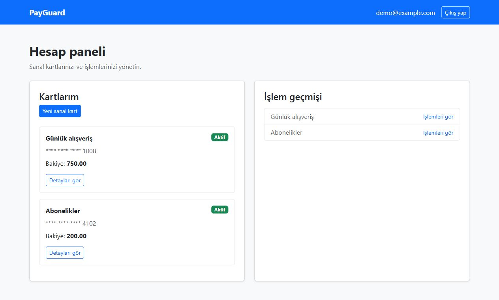
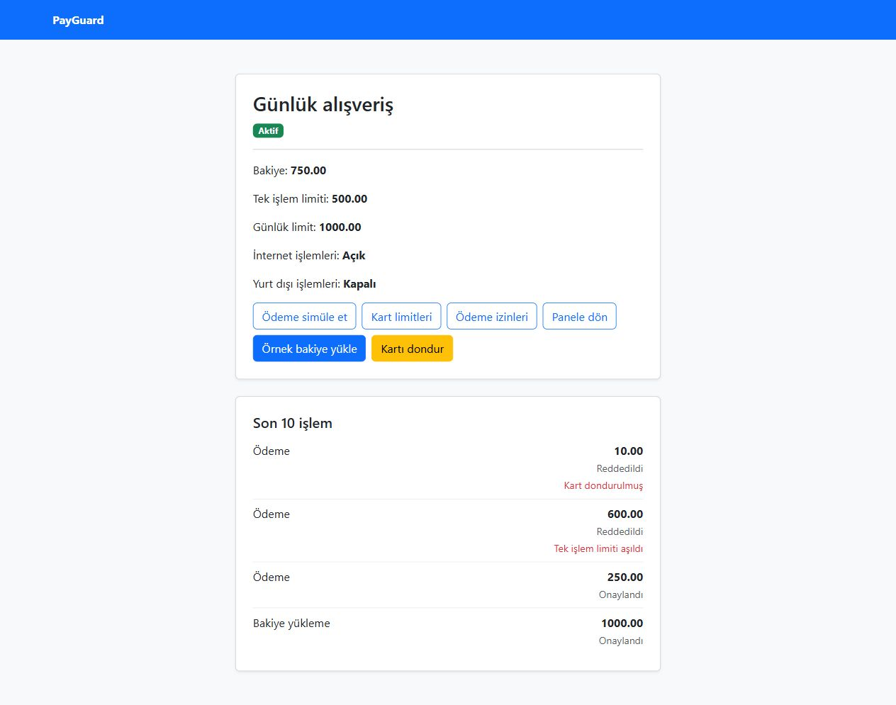
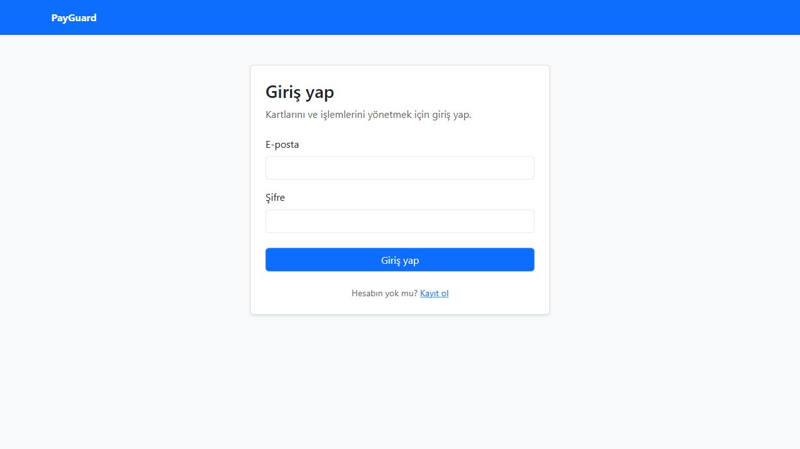
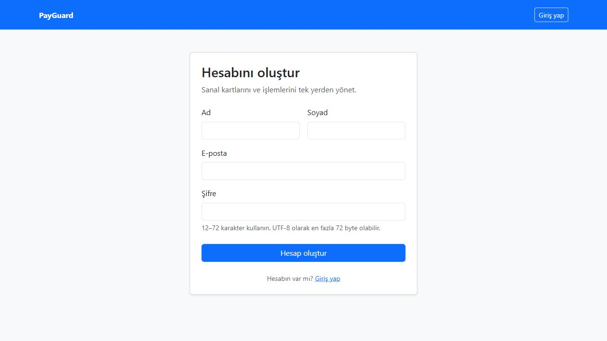
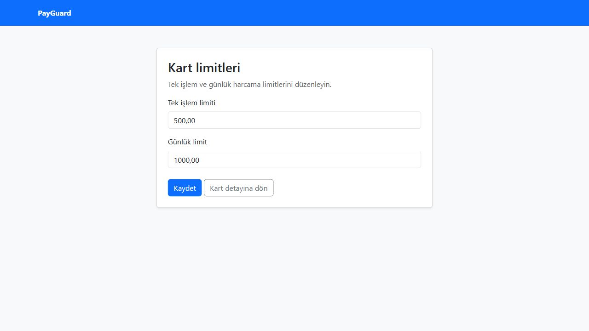
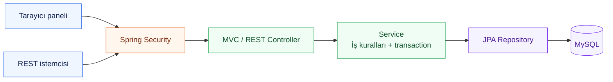
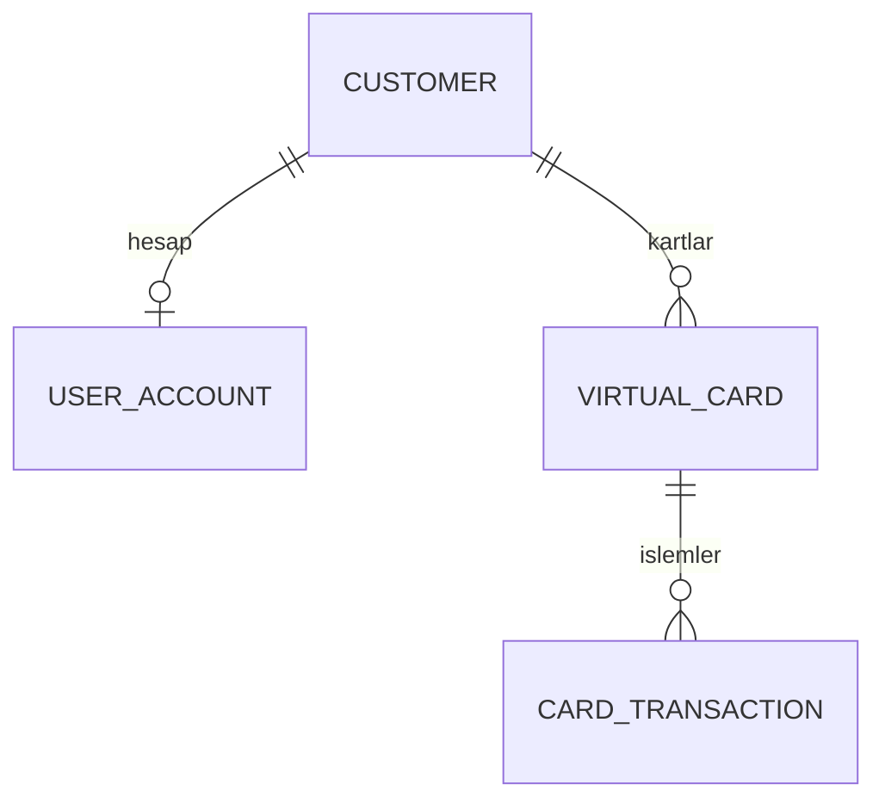
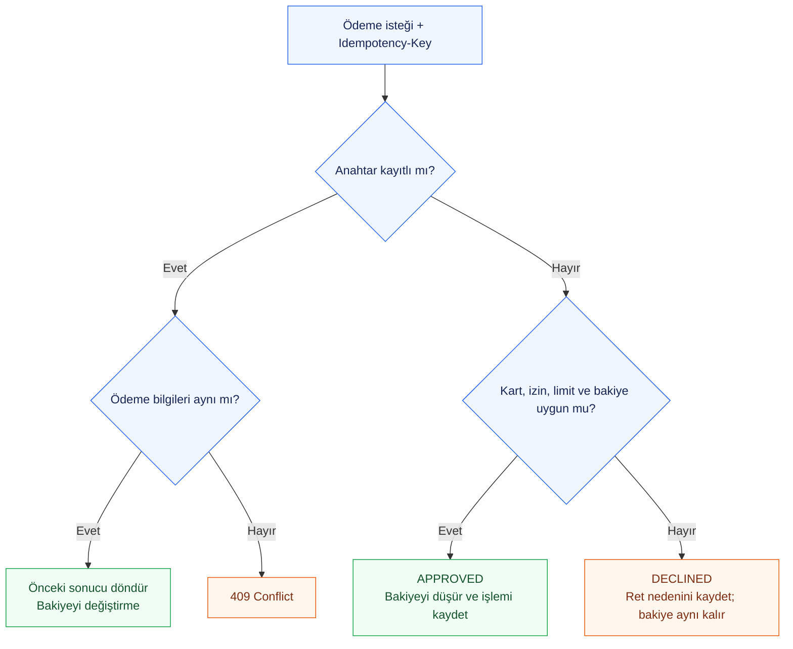

# PayGuard

> Sanal kart yönetimi ve ödeme simülasyonu sunan Spring Boot uygulaması; REST API ve Spring MVC kullanıcı paneli içerir.

[](https://openjdk.org/projects/jdk/21/)
[](https://spring.io/projects/spring-boot)
[](https://www.mysql.com/)
[](#testler)
[](https://github.com/onurerkoc-dev/payguard/actions/workflows/ci.yml)
[](https://maven.apache.org/)

PayGuard; kullanıcıların sanal kart oluşturduğu, örnek bakiye yüklediği ve kart durumu, bakiye, limit ve ödeme izinlerine göre ödeme simüle ettiği bir portföy projesidir. Tarayıcı paneli ve REST API aynı servis katmanını kullanır.

**Odak:** aynı ödemenin iki kez işlenmesini önlemek, eş zamanlı bakiye güncellemelerini korumak ve kullanıcıların yalnızca kendi verilerine erişmesini sağlamak.

[Ekranlar](#ekran-görüntüleri) · [Kullanım senaryosu](#kullanım-senaryosu) · [Mimari](#mimari) · [Kurulum](#hızlı-başlangıç) · [Testler](#testler)

## Öne çıkan mühendislik kararları

| Karar | Çözdüğü problem | Uygulama / doğrulama |
|---|---|---|
| **Idempotency** | Ağ kesintisinden sonra aynı ödeme tekrar gönderildiğinde ikinci kez bakiye düşmesi | `Idempotency-Key`, unique constraint ve istek eşleşmesi; tekrar isteğinde aynı işlem ID'si, karar ve kalan bakiye; farklı gövdede `409` |
| **Optimistic locking** | İki işlemin aynı eski bakiyeyi okuyup birbirinin güncellemesini ezmesi | JPA `@Version`; eski sürümle yazma reddedilir, API `409` döner. [Gerçek MySQL testi](src/test/java/dev/onurerkoc/payguard/repository/VirtualCardOptimisticLockingIntegrationTest.java) |
| **Transactional tutarlılık** | Bakiye değişirken işlem kaydının yazılamaması veya kayıt sırasında yarım hesap oluşması | `@Transactional` ile bakiye/işlem ve müşteri/hesap değişiklikleri aynı transaction içinde; DB kısıtları ve rollback |
| **Servis katmanında yetkilendirme** | Başka müşterinin ID'sini kullanarak kartına erişme | `@PreAuthorize` ve `CustomerAccessPolicy`; MVC ve REST aynı sahiplik kontrolünden geçer. [Yetki testleri](src/test/java/dev/onurerkoc/payguard/security/VirtualCardServiceAuthorizationTest.java) |
| **Gerçek veritabanıyla test ve sürümlü şema** | Mock testlerin MySQL kısıtlarını kaçırması, ortamlarda şemanın farklılaşması | Testcontainers + MySQL 8.4, unique constraint ve stale-version testleri; Flyway migration'ları ve Hibernate `validate` |

## Neler yapılabilir?

| Alan | Özellikler |
|---|---|
| Hesap | Kayıt, e-posta ile giriş, güvenli çıkış; müşteri profili için REST işlemleri |
| Sanal kart | Kart oluşturma, maskelenmiş liste, bakiye yükleme, dondurma/açma |
| Ödeme | Tek işlem/günlük limit, internet ve yurt dışı izinleri, ret nedenleri |
| İşlem geçmişi | Onaylanan ve reddedilen işlemler; API'de sayfalama, panelde son 10 işlem |
| Yönetici | İlk admin kurulumu ve müşteri listesi |

## Ekran görüntüleri

Görüntüler gerçek uygulamadan, ayrı bir demo veritabanı ve örnek hesapla alınmıştır.

**Kullanıcı paneli** — sanal kartlar, bakiye ve işlem geçmişine erişim.



**Kart detayı** — limitler, ödeme izinleri ve gerekçeleriyle işlem sonuçları.



<details>
<summary>Giriş, kayıt ve limit ekranlarını göster</summary>

### Giriş



### Kayıt



### Kart limitleri



</details>

## Kullanım senaryosu

1. `/register` üzerinden normal kullanıcı oluşturun ve `/login` adresinden giriş yapın.
2. **Yeni sanal kart** ile tek işlem limiti `500`, günlük limiti `1.000` olan bir kart oluşturun.
3. Kart detayından **Örnek bakiye yükle** ile `1.000` yükleyin.
4. **Ödeme simüle et** ekranında aşağıdaki işlemleri deneyin.

| Adım | Beklenen sonuç | Kalan bakiye |
|---|---|---:|
| `250` tutarında, izin verilen ödeme | Onaylandı | `750` |
| `600` tutarında ödeme | Tek işlem limiti nedeniyle reddedildi | `750` |
| Kartı dondurup `10` tutarında ödeme | Kart dondurulmuş olduğu için reddedildi | `750` |
| Kartı yeniden kullanıma açma | Kart aktif; önceki işlemler geçmişte kalır | `750` |

API üzerinden aynı ödeme gövdesini aynı `Idempotency-Key` ile yeniden gönderdiğinizde aynı işlem ID'si, karar ve işlem anındaki kalan bakiye döner; bakiye tekrar düşmez. Aynı anahtar farklı ödeme bilgileriyle gönderilirse `409 Conflict` oluşur. [Endpointler ve örnek istek →](docs/api.md)

## Teknoloji yığını

| Alan | Teknoloji |
|---|---|
| Backend | Java 21, Spring Boot, Spring MVC, Jakarta Validation |
| Arayüz | Thymeleaf, Bootstrap |
| Güvenlik | Spring Security, session, BCrypt, CSRF |
| Veritabanı | MySQL 8.4, Spring Data JPA, Flyway |
| Test ve teslim | JUnit, Mockito, MockMvc, Testcontainers, GitHub Actions, Docker Compose |
| API dokümantasyonu | OpenAPI 3, Swagger UI |

## Mimari

Controller'lar HTTP ve form işlemlerini, servisler iş kurallarını, repository'ler veritabanı erişimini yönetir. API ve panel aynı kuralları uygular.


```mermaid
flowchart LR
    UI["Tarayıcı paneli"] --> SEC["Spring Security"]
    API["REST istemcisi"] --> SEC
    SEC --> WEB["MVC / REST Controller"]
    WEB --> SVC["Service<br/>İş kuralları + transaction"]
    SVC --> REPO["JPA Repository"]
    REPO --> DB[("MySQL")]

    classDef client fill:#eff6ff,stroke:#2563eb,color:#172554
    classDef security fill:#fff7ed,stroke:#ea580c,color:#7c2d12
    classDef application fill:#f0fdf4,stroke:#16a34a,color:#14532d
    classDef storage fill:#f5f3ff,stroke:#7c3aed,color:#4c1d95
    class UI,API client
    class SEC security
    class WEB,SVC application
    class REPO,DB storage
```

Temel ilişkiler: normal kullanıcı bir müşteri profiline bağlıdır; adminin müşteri ilişkisi yoktur. Kartlar müşteriye, işlemler karta bağlıdır.


```mermaid
erDiagram
    CUSTOMER ||--o| USER_ACCOUNT : "hesap"
    CUSTOMER ||--o{ VIRTUAL_CARD : "kartlar"
    VIRTUAL_CARD ||--o{ CARD_TRANSACTION : "islemler"
```

[Veri modeli, güvenlik yetkileri ve tasarım kararları →](docs/architecture.md)

## Ödeme nasıl değerlendirilir?


```mermaid
flowchart TD
    REQUEST["Ödeme isteği + Idempotency-Key"] --> EXISTS{"Anahtar kayıtlı mı?"}
    EXISTS -->|Evet| MATCH{"Ödeme bilgileri aynı mı?"}
    MATCH -->|Evet| REPLAY["Önceki sonucu döndür<br/>Bakiyeyi değiştirme"]
    MATCH -->|Hayır| CONFLICT["409 Conflict"]
    EXISTS -->|Hayır| RULES{"Kart, izin, limit ve bakiye uygun mu?"}
    RULES -->|Evet| APPROVED["APPROVED<br/>Bakiyeyi düşür ve işlemi kaydet"]
    RULES -->|Hayır| DECLINED["DECLINED<br/>Ret nedenini kaydet; bakiye aynı kalır"]

    classDef decision fill:#eff6ff,stroke:#2563eb,color:#172554
    classDef approved fill:#f0fdf4,stroke:#16a34a,color:#14532d
    classDef rejected fill:#fff7ed,stroke:#ea580c,color:#7c2d12
    class REQUEST,EXISTS,MATCH,RULES decision
    class APPROVED,REPLAY approved
    class CONFLICT,DECLINED rejected
```

- Kart dondurulmuşsa veya süresi dolmuşsa ödeme reddedilir.
- Bakiye, tek işlem/günlük limit ve internet/yurt dışı izinleri kontrol edilir.
- İşlem sonucuyla birlikte o andaki bakiye saklanır; tekrar isteğinde aynı işlem ID'si, karar ve bakiye döner.
- JPA `@Version`, eş zamanlı kart güncellemelerinde kayıp güncellemeyi engeller.

## Güvenlik

- Yeni kayıt her zaman `USER` olur; formdan rol veya müşteri ID'si belirlenemez.
- Şifreler BCrypt hash olarak saklanır; form hatalarında geri gösterilmez.
- Servislerde rol ve müşteri sahipliği denetlenir; URL'deki ID'yi değiştirmek başka hesaba erişim sağlamaz.
- Form işlemlerinde CSRF koruması açıktır; çıkış POST isteğiyle yapılır.
- Admin kurulumu özel yerel dosyada yapılır; `.env` ve bu dosya Git'e/imaja eklenmez.

## Hızlı başlangıç

Docker Desktop ve Git gerekir. İlk çalıştırmada imaj içinde JAR üretilir; bilgisayarda ayrıca Java/MySQL kurulması gerekmez.

```bash
git clone https://github.com/onurerkoc-dev/payguard.git
cd payguard
```

PowerShell'de `.env` dosyasını hazırlayın:

```powershell
Copy-Item .env.example .env
```

macOS/Linux için `cp .env.example .env` kullanın. `.env` içinde `PAYGUARD_DB_PASSWORD` ve `PAYGUARD_MYSQL_ROOT_PASSWORD` alanlarına farklı, boş olmayan şifreler yazın.

```bash
docker compose config --quiet
docker compose up --build -d
```

| Kaynak | Adres |
|---|---|
| Giriş / kayıt | `http://localhost:8080/login` · `http://localhost:8080/register` |
| Kullanıcı paneli | `http://localhost:8080/` |
| Yönetici paneli | `http://localhost:8080/admin` — admin hesabı gerekir |
| Workbench bağlantısı | `127.0.0.1:3307` · `payguard_user` · schema `payguard` |

İlk admin kurulumu isteğe bağlıdır; normal kayıtla kullanıcı akışını deneyebilirsiniz. Docker, IntelliJ'deki yerel MySQL'den ayrı bir veritabanı kullanır. Swagger UI, `local` profilinde `/swagger-ui.html` adresindedir.

```bash
docker compose stop       # Durdur; container ve veriler kalsın
docker compose start      # Yeniden başlat
docker compose down       # Container'ları kaldır; veriler volume'da kalsın
```

`docker compose down --volumes` veritabanı verilerini de siler.

[IntelliJ/Java 21 kurulumu, profiller, admin ve Docker ayrıntıları →](docs/setup.md)

## Testler

Son tam doğrulama: **238 test, 0 failure, 0 error, 0 skipped**. GitHub Actions aynı test paketini PR'larda ve `main` değişikliklerinde çalıştırır.

| Kapsam | Doğrulanan davranış |
|---|---|
| İş kuralları | Ödeme ret nedenleri, bakiye/limitler, idempotency |
| Web ve güvenlik | Form/API doğrulaması, CSRF, giriş/çıkış, rol ve sahiplik |
| Gerçek MySQL | Unique constraint, kalıcılık, hesap yaşam döngüsü, optimistic locking |

Java 21 ve çalışan Docker ile:

```powershell
.\mvnw.cmd clean test
```

macOS/Linux: `./mvnw clean test`. Testcontainers izole MySQL container'ları oluşturur; kullanıcının veritabanını kullanmaz. Docker imajı build edilirken testler atlanır, testler ayrı çalıştırılır.

[Test yapısı ve ortamı →](docs/testing.md)

## Proje kapsamı

PayGuard eğitim ve portföy amacıyla geliştirilmiştir. Kart numaraları sentetiktir; bakiye yükleme ve ödemeler simülasyondur. Gerçek ödeme sağlayıcısı entegrasyonu içermez.

Mevcut kapsam: REST API, kullanıcı/yönetici paneli, güvenlik kontrolleri, Flyway, Docker ve CI. Profil düzenleme ekranı, şifre değiştirme, sağlık endpointi ve test kapsamı raporu henüz eklenmemiştir. İnternete deployment için ayrıca HTTPS ve sunucu yapılandırması gerekir.

## Geliştirici

**Onur Erkoç** · [GitHub](https://github.com/onurerkoc-dev) · [Portfolio](https://onurerkoc.dev)
