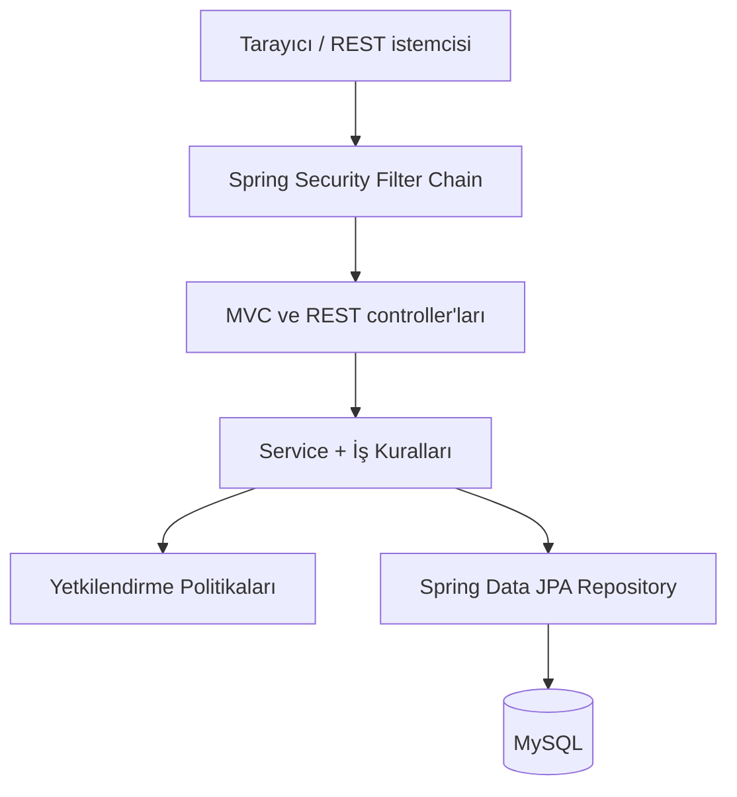
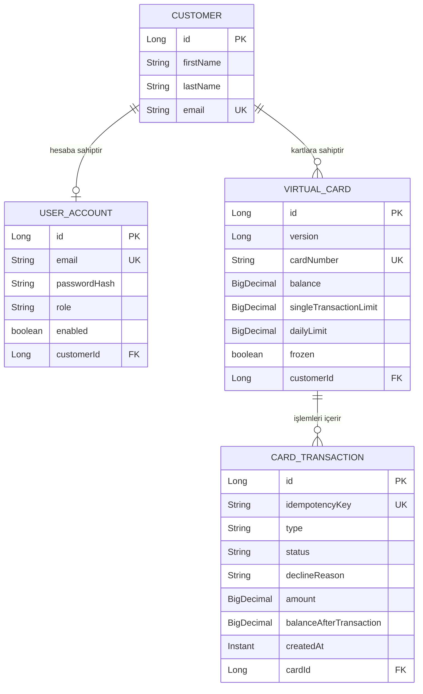
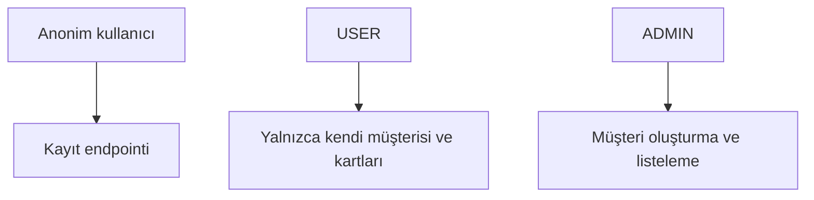
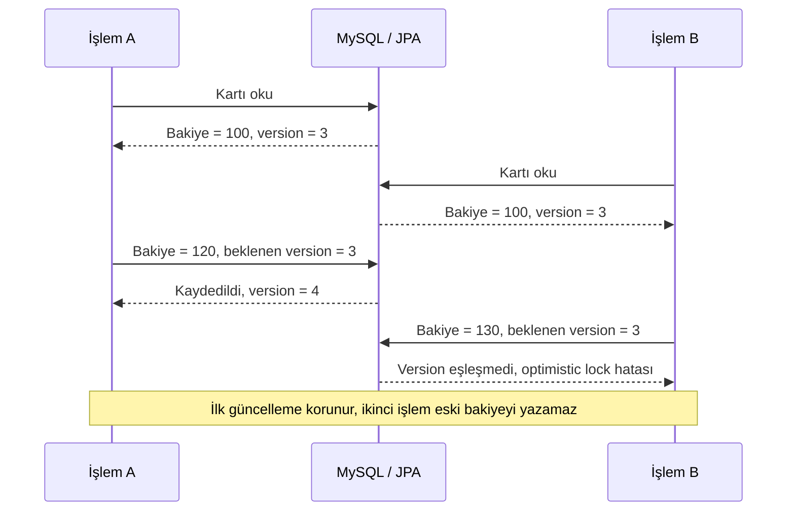

# Mimari ve tasarım kararları

[← PayGuard](../README.md)

## Mimari

PayGuard, sorumlulukları birbirinden ayıran katmanlı bir mimari kullanır.



| Katman | Sorumluluk |
|---|---|
| Controller | HTTP isteğini alır, doğrulanmış DTO'yu servise iletir ve HTTP cevabını üretir. |
| DTO | API'ye giren ve API'den çıkan verinin sözleşmesini tanımlar. |
| Service | Ödeme, limit, sahiplik ve hesap yaşam döngüsü gibi iş kurallarını uygular. |
| Security | Kimlik doğrulama, rol ve kaynak sahipliği kontrollerini gerçekleştirir. |
| Repository | Entity'lerin MySQL üzerinde kalıcı hâle getirilmesini sağlar. |
| Exception Handler | İş ve doğrulama hatalarını anlamlı HTTP cevaplarına dönüştürür. |

## Veri modeli



## Güvenlik modeli

PayGuard, Spring Security üzerinde session tabanlı kimlik doğrulama kullanır. Geliştirme aşamasında form login ve HTTP Basic desteği aktiftir.



| İşlem | Anonim | USER | ADMIN |
|---|:---:|:---:|:---:|
| Kullanıcı kaydı | ✅ | ✅ | ✅ |
| Kendi müşteri profilini görüntüleme | ❌ | ✅ | Sahiplik kuralına bağlı |
| Kendi profilini güncelleme veya silme | ❌ | ✅ | Sahiplik kuralına bağlı |
| Kendi sanal kartlarını yönetme | ❌ | ✅ | Sahiplik kuralına bağlı |
| Müşteri oluşturma ve tüm müşterileri listeleme | ❌ | ❌ | ✅ |

Uygulanan güvenlik önlemleri:

- Şifreler açık metin olarak değil, BCrypt hash olarak saklanır.
- Kullanıcı kayıt sırasında rol seçemez; yeni hesap her zaman `USER` olur.
- `@EnableMethodSecurity` ve `@PreAuthorize` ile servis katmanı korunur.
- `CustomerAccessPolicy`, giriş yapan kullanıcının hedef müşteri kaydının sahibi olduğunu doğrular.
- CSRF koruması açık bırakılmıştır.
- Durum değiştiren browser isteklerinin geçerli CSRF token taşıması gerekir.
- Başarılı hesap silme işleminden sonra session ve SecurityContext sonlandırılır.

> `permitAll`, CSRF kontrolünü kapatmaz. Bu nedenle kayıt endpointi herkese açık olsa da browser üzerinden yapılan `POST`, `PUT`, `PATCH` ve `DELETE` isteklerinde CSRF token gereklidir.

## Proje yapısı

```text
src
├── main
│   ├── java/dev/onurerkoc/payguard
│   │   ├── config       # Spring Security ve OpenAPI yapılandırması
│   │   ├── controller   # REST API ve MVC sayfaları
│   │   ├── dto          # Request ve response sözleşmeleri
│   │   ├── entity       # JPA domain modelleri
│   │   ├── exception    # Domain hataları ve global hata yönetimi
│   │   ├── repository   # Spring Data JPA repositoryleri
│   │   ├── security     # UserDetails ve sahiplik politikası
│   │   └── service      # İş kuralları ve transaction sınırları
│   └── resources
│       ├── templates                     # Thymeleaf HTML sayfaları
│       ├── db/migration                  # Flyway migration'ları
│       ├── application.properties        # Ortak ayarlar
│       ├── application-local.properties  # Yerel MySQL bağlantısı
│       └── application-prod.properties   # Production environment değişkenleri
└── test
    ├── java/dev/onurerkoc/payguard
    │   ├── config       # Testcontainers yapılandırması
    │   ├── controller   # MockMvc testleri
    │   ├── entity       # Entity davranış testleri
    │   ├── repository   # Gerçek MySQL entegrasyon testleri
    │   ├── security     # Authentication ve authorization testleri
    │   └── service      # Unit testler
    └── resources
        └── application-test.properties   # Test ortamı ayarları
```

## Optimistic locking örneği

İki işlem aynı kartın `version=3` durumunu okur. İlk yazma version değerini `4` yapar. İkinci işlem eski version ile yazmaya çalıştığında güncelleme reddedilir; ilk işlemin bakiyesi ezilmez. Uygulama API'de `409 Conflict` döndürür; otomatik retry uygulanmaz.



Bu davranış [VirtualCardOptimisticLockingIntegrationTest](../src/test/java/dev/onurerkoc/payguard/repository/VirtualCardOptimisticLockingIntegrationTest.java) içinde ayrı transaction'larla okunmuş eski kartın kaydedilmesinin reddedildiği gerçek MySQL üzerinde doğrulanır. Bu test bir yük/performans testi değildir.

## Tasarım kararları

### Neden session tabanlı authentication?

Spring MVC ve Thymeleaf paneli, kullanıcı girişini session üzerinden yönetir.
Girişten sonra tarayıcı oturum çerezini sonraki isteklerde gönderir; kullanıcı
kimliğini her formda ayrıca taşımamız gerekmez. Spring Security, kart
işlemlerinde oturumu ve CSRF korumasını kontrol eder.

### Neden idempotency?

Ağ problemi nedeniyle aynı ödeme isteği yeniden gönderilebilir. `Idempotency-Key`, tekrar isteğinin ikinci kez bakiye düşürmesini engeller. Aynı anahtar farklı ödeme verileriyle kullanılırsa istek çakışma olarak reddedilir.

### Neden optimistic locking?

Aynı kart bakiyesini iki transaction eş zamanlı değiştirebilir. `@Version`, eski veriyi kullanan ikinci transaction'ın ilk güncellemeyi sessizce ezmesini engeller.

### Neden Testcontainers?

Repository davranışları yalnızca mock veya H2 ile değil, üretimde kullanılan veritabanı ailesiyle doğrulanır. Testcontainers her test çalıştırmasında izole ve tekrarlanabilir bir MySQL ortamı sağlar.

### Neden Flyway?

Hibernate'in şemayı otomatik olarak güncellemesi yerine bütün veritabanı
değişiklikleri sürümlü SQL dosyalarıyla yönetilir. Böylece şemanın hangi
değişikliklerden geçtiği Git geçmişinden ve `flyway_schema_history`
tablosundan izlenebilir.

Yeni bir ortam V1'den başlayarak aynı migration sırasını çalıştırır.
Uygulanmış migration dosyaları değiştirilmez; sonraki değişiklikler V4,
V5 ve devam eden sürümler olarak eklenir.

### Neden ortam profilleri ayrıldı?

Yerel geliştirme, otomatik test ve production ortamları aynı bağlantı
bilgilerini kullanmaz. Spring Profiles sayesinde iş kodu değiştirilmeden yalnızca
ortama ait yapılandırma seçilir. Yerel şifre kaynak koda yazılmaz, testler
izole MySQL container'larında çalışır ve production bağlantısı yalnızca
sunucunun environment variable değerlerinden alınır.

### Neden DTO kullanılıyor?

Entity'ler doğrudan API sözleşmesi yapılmaz. DTO'lar istemcinin gönderebileceği alanları sınırlar, validation kurallarını taşır ve persistence modelinin dışarı sızmasını engeller.
