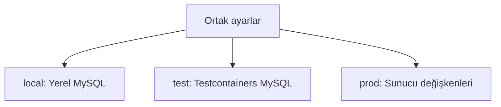

# Kurulum ve çalıştırma

[← PayGuard](../README.md)

## Ortam profilleri

PayGuard, aynı uygulama kodunu farklı ortamlarda güvenli biçimde çalıştırmak
için Spring Profiles kullanır. Ortak ayarlar `application.properties`
dosyasında tutulur; veritabanı bağlantısı gibi ortama göre değişen değerler
ilgili profil dosyasından alınır.



| Profil | Yapılandırma kaynağı | Kullanım amacı |
|---|---|---|
| `local` | `application-local.properties` | Geliştiricinin bilgisayarındaki MySQL veritabanı |
| `test` | `src/test/resources/application-test.properties` ve `@ServiceConnection` | Docker üzerinde geçici ve izole Testcontainers MySQL |
| `prod` | `application-prod.properties` ve environment variable'lar | Sunucu veya hosting ortamındaki production veritabanı |

Ortak yapılandırmada Hibernate yalnızca Flyway tarafından oluşturulan şemayı
doğrular:

```properties
spring.jpa.hibernate.ddl-auto=validate
spring.jpa.open-in-view=false
```

Production profili bağlantı bilgilerini kaynak koddan değil aşağıdaki
environment variable'lardan bekler:

```text
PAYGUARD_DB_URL
PAYGUARD_DB_USERNAME
PAYGUARD_DB_PASSWORD
PORT
```

Projede bilerek varsayılan profil tanımlanmamıştır. Böylece profil seçilmeden
başlatılan bir deployment'ın yanlışlıkla yerel veritabanına bağlanması yerine
uygulama güvenli biçimde bağlantı hatası vererek durur.

## Projeyi çalıştırma

### Gereksinimler

- Java 21
- Git
- MySQL 8+
- Testcontainers testleri için çalışan Docker Desktop

Kurulumları doğrulayın:

```powershell
java -version
docker --version
docker info
.\mvnw.cmd -version
```

Maven çıktısındaki Java sürümü de `21` olmalıdır.

### 1. Repoyu klonlayın

```bash
git clone https://github.com/onurerkoc-dev/payguard.git
cd payguard
```

### 2. MySQL veritabanını hazırlayın

```sql
CREATE DATABASE payguard
    CHARACTER SET utf8mb4
    COLLATE utf8mb4_unicode_ci;

CREATE USER 'payguard_user'@'localhost'
    IDENTIFIED BY 'guvenli-bir-sifre';

GRANT ALL PRIVILEGES ON payguard.*
    TO 'payguard_user'@'localhost';

FLUSH PRIVILEGES;
```

### 3. Yerel ortam değişkenlerini tanımlayın

Geçerli PowerShell oturumunda veritabanı şifresini tanımlayın ve `local`
profilini etkinleştirin:

```powershell
$env:PAYGUARD_DB_PASSWORD="guvenli-bir-sifre"
$env:SPRING_PROFILES_ACTIVE="local"
```

macOS/Linux:

```bash
export PAYGUARD_DB_PASSWORD="guvenli-bir-sifre"
export SPRING_PROFILES_ACTIVE="local"
```

Environment variable değerleri yalnızca o terminal oturumu için geçerlidir.
Şifreyi herhangi bir `application*.properties` dosyasına veya Git geçmişine
eklemeyin.

### 4. Veritabanı migration'ları

Uygulama başlatıldığında Flyway, `src/main/resources/db/migration`
altındaki migration dosyalarını sürüm sırasına göre otomatik olarak çalıştırır:

```text
V1__initial_schema.sql
V2__add_payment_transaction_details.sql
V3__create_user_accounts.sql
```

- `V1`, temel müşteri, sanal kart ve işlem tablolarını oluşturur.
- `V2`, ödeme işleminin internet, yurt dışı ve işlem sonrası bakiye bilgilerini ekler.
- `V3`, Spring Security kullanıcı hesapları tablosunu oluşturur.
- Uygulanan migration'lar `flyway_schema_history` tablosunda kayıt altında tutulur.

Tabloları elle oluşturmak gerekmez. Hibernate şemayı değiştirmez;
`spring.jpa.hibernate.ddl-auto=validate` ayarıyla entity ve tablo yapılarının
uyumlu olduğunu doğrular.

Varsayılan yapılandırmada `baseline-on-migrate` açık değildir. Böylece Flyway
geçmişi bulunmayan dolu bir veritabanının yanlışlıkla sahiplenilmesi engellenir.

### 5. Uygulamayı başlatın

Windows:

```powershell
.\mvnw.cmd spring-boot:run
```

macOS/Linux:

```bash
./mvnw spring-boot:run
```

Uygulama varsayılan olarak `http://localhost:8080` adresinde çalışır.
Başlangıç logunda aşağıdaki satır görülmelidir:

```text
The following 1 profile is active: "local"
```

### Tarayıcıdan kullanıcı kaydı

Giriş ekranı `http://localhost:8080/login` adresindedir. E-posta ve şifreyle
giriş yapabilir veya **Hesabın yok mu? Kayıt ol** bağlantısıyla kayıt
formunu açabilirsiniz. Hatalı girişte genel hata mesajı, çıkıştan sonra
başarı mesajı gösterilir.

`http://localhost:8080/register` adresinde ad, soyad, e-posta ve şifreyle
normal kullanıcı hesabı oluşturabilirsiniz. Şifre 12–72 karakter ve UTF-8
olarak en fazla 72 byte olmalıdır. Başarılı kayıttan sonra **Giriş yap**
bağlantısını kullanın; kayıt işlemi otomatik giriş yapmaz.

Form mevcut kayıt servisini kullanır; müşteri profili ve `USER` hesabı
birlikte oluşturulur, şifre BCrypt hash olarak saklanır. Formdan rol veya
müşteri ID'si seçilemez. Kullanılan e-posta ve geçersiz bilgiler formda
gösterilir; hata durumunda şifre alanı boş bırakılır.

`/register` herkese açıktır, ancak POST isteği CSRF token gerektirir.
Kart işlemleri ve yönetici panelindeki mevcut erişim kontrolleri korunur.

### İlk admin hesabının kurulumu

Repodaki `src/main/resources/application.properties` içinde admin kurulumu
kapalı, e-posta ve şifre alanları boştur. Bu dosyaya gerçek hesap bilgilerini
yazmayın. Kurulum bilgileri projenin ana klasöründeki
`config/application.properties` dosyasında tutulur.

Bu yerel dosya `.gitignore` ile Git takibinin dışındadır ve normal Maven
paketlemesinde JAR'a eklenmez. Projeyi yeni klonladıysanız `config` klasörünü
ve içindeki `application.properties` dosyasını kendiniz oluşturun:

```properties
payguard.admin-bootstrap.enabled=false
payguard.admin-bootstrap.email=
payguard.admin-bootstrap.password=
```

İlk kurulumda **yerel dosyada** `enabled=true` yapın, e-posta ve şifre
alanlarını doldurun. Şifre en az 12 karakter, en fazla 72 karakter ve
UTF-8 olarak en fazla 72 byte olmalıdır. IntelliJ'den uygulamayı normal
şekilde başlatın. Run Configuration içindeki **Working directory** projenin
ana klasörü olmalıdır; Spring Boot bu klasördeki `config/application.properties`
dosyasını otomatik olarak okur. Terminalden çalıştırırken de uygulamayı bu
ana klasörden başlatın.

Veritabanı bağlantısı başarılıysa başlangıçta admin hesabı oluşturulur
ve logda `Admin hesabı oluşturuldu.` görülür. Ardından **yerel dosyada**
`enabled=false` yapın, e-posta ve şifre alanlarını boşaltıp uygulamayı
yeniden başlatın. Hesap veritabanında kalır; şifre yalnızca BCrypt hash
olarak saklanır. Repodaki varsayılan dosyayı değiştirmek gerekmez.

Aynı yöntem `local` ve `prod` profillerinde kullanılabilir. Sunucuda da
uygulamanın başlatıldığı klasörde bir `config/application.properties`
dosyası hazırlayın. Veritabanı bağlantı bilgileri admin hesabından ayrıdır
ve ilgili profil için tanımlı olmalıdır.

Aynı aktif admin zaten varsa mevcut hesap ve şifresi korunur. Normal
kullanıcıya veya müşteri profiline ait e-posta kullanılamaz; devre dışı
admin hesabı bu kurulumla yeniden etkinleştirilmez. Kurulum açıkken
geçersiz veya eksik bilgiler uygulamanın başlangıcını durdurur.

Normal kayıt endpointi her zaman `USER` oluşturur; herkese açık bir
admin kurulum endpointi yoktur. Admin şifresi kurulum loguna yazılmaz.

### Yönetici paneli

Giriş yaptıktan sonra `http://localhost:8080/` adresini açın. `ADMIN`
hesabı `/admin` yönetici paneline yönlendirilir; normal kullanıcı kendi
kart panelinde kalır. Yönetici paneli müşterilerin ID, ad, soyad ve
e-posta bilgilerini tablo olarak gösterir. Müşteri yoksa boş liste mesajı
görülür. Normal kullanıcı `/admin` adresine erişemez.

Paneldeki **Çıkış yap** düğmesi CSRF korumalı POST isteğiyle oturumu kapatır.

### Production profili

Production ortamında uygulama başlamadan önce aşağıdaki değerler hosting
sağlayıcısı veya sunucu üzerinden tanımlanır:

```powershell
$env:SPRING_PROFILES_ACTIVE="prod"
$env:PAYGUARD_DB_URL="jdbc:mysql://db-host:3306/payguard"
$env:PAYGUARD_DB_USERNAME="payguard_user"
$env:PAYGUARD_DB_PASSWORD="production-sifresi"
$env:PORT="8080"
```

Bu değerler yalnızca örnektir; gerçek production bilgileri repoya eklenmez.

### Docker Compose ile çalıştırma

Docker Desktop açık olmalıdır. Projenin ana klasöründe `.env.example`
dosyasını `.env` adıyla kopyalayın:

```powershell
Copy-Item .env.example .env
```

macOS/Linux için `cp .env.example .env` kullanın. Yerel `.env` içinde
`PAYGUARD_DB_PASSWORD` ve `PAYGUARD_MYSQL_ROOT_PASSWORD` alanlarına farklı,
boş olmayan şifreler yazın. `.env` Git takibine ve Docker build ortamına
gönderilmez; gerçek şifreleri `.env.example` veya `compose.yaml` içine yazmayın.
`PAYGUARD_HTTP_PORT` varsayılan olarak `8080` değerindedir. IntelliJ'deki
uygulama bu portu kullanıyorsa onu durdurun veya bu değeri `8081` yapın.
Terminalde tanımlı aynı adlı değişkenler `.env` değerlerinden önceliklidir.

```powershell
docker compose config --quiet
docker compose up --build -d
docker compose ps
docker compose logs -f app
```

`config --quiet`, ayarları şifreleri ekrana basmadan doğrular. Uygulama
hazır olduğunda `http://localhost:8080` adresini açın; portu değiştirdiyseniz
yeni değeri kullanın. Port yalnızca yerel bilgisayara açılır. `logs -f`
komutundan `Ctrl+C` ile çıkmak container'ları durdurmaz.

Dockerfile, Maven Wrapper ile Java 21 üzerinde JAR üretir; son imajda
JRE ve uygulama bulunur. İmaj build edilirken testler çalıştırılmaz;
238 testten oluşan suite ayrı test komutuyla ve GitHub CI'da doğrulanır.
Compose, MySQL 8.4 hazır olana kadar uygulamayı bekletir. MySQL'de uygulama
kullanıcısıyla `SELECT 1` sorgusu başarılı olunca PayGuard başlatılır.

Uygulama mevcut `prod` profilini kullanarak bağlantı bilgilerini environment
değerlerinden okur. Burada `prod` seçimi Docker'ı internete yayınlamaz;
bu Compose dosyası yerel çalıştırma içindir. MySQL'e `mysql:3306` üzerinden
bağlanılır; MySQL portu yalnızca yerel bilgisayarda `127.0.0.1:3307` adresine
açılır. Flyway migration'ları uygulama başlangıcında çalışır.

MySQL Workbench içinde mevcut bağlantınızı koruyup `PayGuard Docker` adlı
ayrı bir Standard TCP/IP bağlantısı oluşturun: Hostname `127.0.0.1`, Port
`3307`, Username `payguard_user`, Default Schema `payguard`. Bağlantı şifresi
yerel `.env` dosyasındaki `PAYGUARD_DB_PASSWORD` değeridir; paneldeki admin
şifresi değildir. Workbench ile uygulama aynı Docker veritabanını kullanır.

MySQL verileri `mysql_data` adlı kalıcı volume'da saklanır. Bu veritabanı
IntelliJ'deki yerel MySQL'den ayrıdır; mevcut müşteri ve admin hesapları
otomatik taşınmaz. Docker için ilk admin gerektiğinde yukarıdaki kurulum
adımlarını aynı özel `config/application.properties` dosyasında uygulayın.
Compose bu klasörü `/app/config` yoluna salt okunur bağlar; dosya imaja
eklenmez. Kurulumdan sonra yerel dosyada bilgileri temizleyip
`docker compose restart app` çalıştırın. Aynı klasörle IntelliJ'den
çalıştırırken bootstrap ayarlarının kapalı olduğundan emin olun.

Container'ları kaldırıp verileri saklamak için:

```powershell
docker compose down
```

Tekrar `docker compose up -d` çalıştırınca aynı volume kullanılır.
`docker compose down --volumes` veritabanı volume'unu da siler; verileri
saklamak istediğinizde kullanmayın. Volume ilk kez oluşturulduktan sonra
`.env` içindeki şifreleri değiştirmek mevcut MySQL hesaplarının şifrelerini
değiştirmez. Bunun için veritabanındaki hesabın şifresi de güncellenmelidir.
