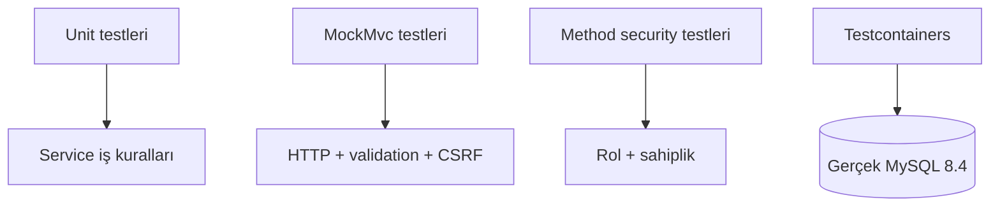

# Test rehberi

[← PayGuard](../README.md)

## Test stratejisi

PayGuard'ın güncel test tabanı **238 başarılı testten** oluşur.



| Test türü | Doğruladığı alan |
|---|---|
| Unit test | Servis kuralları, ödeme kararları, idempotency ve hata senaryoları |
| Controller testi | Endpoint, durum kodu, JSON cevabı, validation ve CSRF davranışı |
| Security testi | Login, yanlış şifre, logout, session, rol ve kaynak sahipliği |
| Repository entegrasyon testi | Gerçek MySQL üzerindeki unique constraint ve kalıcılık davranışı |
| Optimistic locking testi | Aynı kartı eş zamanlı güncelleyen işlemlerde kayıp güncellemenin engellenmesi |
| Yaşam döngüsü testi | Müşteri silinirken bağlı kullanıcı hesabının tutarlı biçimde kaldırılması |

Tüm testleri çalıştırmak için:

```powershell
.\mvnw.cmd clean test
```

macOS/Linux:

```bash
./mvnw clean test
```

Testcontainers, entegrasyon testleri sırasında ihtiyaç duyulan izole
`mysql:8.4` container'larını otomatik olarak başlatır. Tam test paketi
çalışırken Docker Desktop'ta rastgele isim ve portlara sahip birden fazla
geçici MySQL container'ı görülebilir; bu normaldir.

Gerçek veritabanı kullanan context ve repository testleri
`@ActiveProfiles("test")` ile test profilini etkinleştirir. JDBC URL, kullanıcı
adı ve şifre dosyaya yazılmaz; `@ServiceConnection` bu değerleri çalışan
MySQL container'ından Spring Boot'a otomatik olarak aktarır. Mockito tabanlı
unit testleri gerçek veritabanına ihtiyaç duymadığı için bu profili kullanmaz.

`Ryuk` isimli yardımcı container, testler tamamlandığında geçici kaynakların
temizlenmesini yönetir. MySQL image'ı daha önce indirildiyse Docker aynı
image'ı yeniden indirmez.

Beklenen güncel sonuç:

```text
Tests run: 238, Failures: 0, Errors: 0, Skipped: 0
BUILD SUCCESS
```
